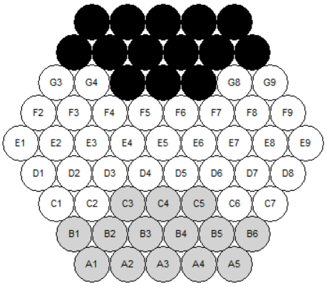
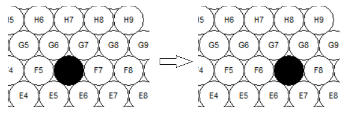
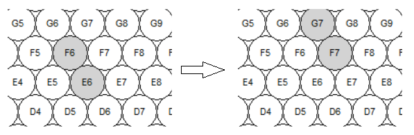
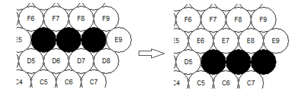
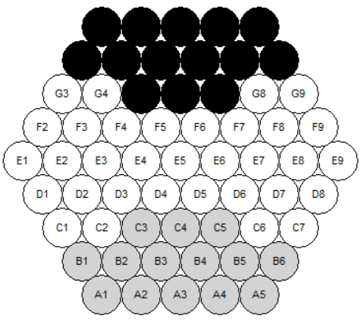
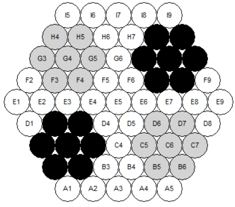
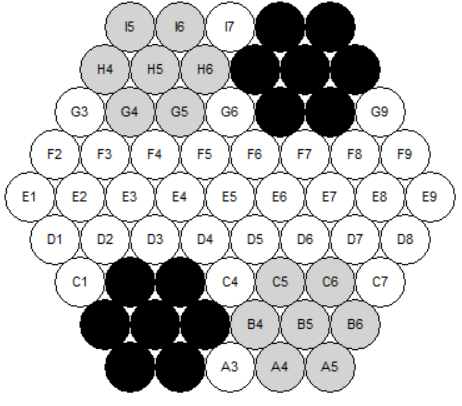

# COMP 3981 Project
## Part 2

## Team Members
- Mangat Toor
- Nicolas Rodriguez
- Tomasz Stojek
- Vitor Guara
___

## Contents

### I &nbsp;&nbsp;&nbsp;&nbsp;Game Board Representation

### II &nbsp;&nbsp;&nbsp;State Space Generation

### III&nbsp;&nbsp;&nbsp;Moving Notation

### IV&nbsp;&nbsp;Team Member Contribution

### V&nbsp;&nbsp;&nbsp;&nbsp;References

### V&nbsp;&nbsp;&nbsp;&nbsp;Additional Documents


### I &nbsp;&nbsp;&nbsp;&nbsp;Game Board Representation
The state is represented by a dictionary where the key is a tuple of two integers: 
(int letter, int number). 
The first int in the tuple is used to represent the letter, with A will be treated as 1, and B as 2 etc.
The values in each dictionary entry is a string (String color_of_marble) representing a black or white marble. (“w” or “b”)
For the above board :  
board = dictionary
Visual Representation		State Representation
(A,1)				board(1,1).value = “w”
(C,2)				board(3,2).value = None
(G,5) 				board(7,5).value = “b”


 
 
 

state = { 
	(1,1): “white”,
	(3,2): ”None”,
	(7,5): “black”,
	…
	}
  


### II&nbsp;&nbsp;&nbsp;&nbsp;State Space Generation

Moves are represented as `[[X], Z]`, where:

- X: Contains coordinates of each marble that will be moved in an array
- Z: Direction of movement (R, L, UL, DL, UR, DR).
    - R: Right
    - L: Left
    - UL: Up Left
    - DL: Down Left
    - UR: Up Right
    - DR: Down Right

#### Example Notation with Pictures

- Single Black Marble Move Right: `[[F6] ,R]`
  
- Double White Marble (Straight Line) Move Up Left: `[[F5,F6], UL]`
  
- Double White Marble (Diagonal) Move Up Right: `[[F6,E6], UL]`
  
- Triple Black Marble Move Down Right: `[[E6,E7,E8],DR]`
  

### III&nbsp;&nbsp;&nbsp;&nbsp;Problem Formulation

#### a. State Representation

The state is represented by a dictionary(`{circle_name: circle_object}`) of circles that can contain a black or white
marble. With each move, the
marble(s) are moved to the intended circle. It also has a `captured_mables` attribute that stores how many white or
black marbles are captured.

```javascript
state = {
    captured_mables: [w, b],
    circles: {
        "I5": {marble: marble_object(black | white)},
        "H5": {marble: none},
        "G5": {marble: none},
        ...,
    }
}
```

#### b. Initial State

The initial state can be one of three states:

1. Standard  
   
2. German Daisy  
   
3. Belgian Daisy  
   

#### c. Actions

The actions are defined using the move notation and involve moving marbles (1 to 3) to one of six directions (as defined
in part II).

#### d. Transition Model

 Description        | Actions       | Resulting State                                     |
 -------------------|---------------|-----------------------------------------------------|
move to direction 1 | `[marbles],1` | Move each marble to: Circle(old_l, old_num + 1)     |
move to direction 3 | `[marbles],3` | Move each marble to: Circle(old_l, old_num - 1)     |
move to direction 5 | `[marbles],5` | Move each marble to: Circle(old_l + 1, old_num)     |
move to direction 7 | `[marbles],7` | Move each marble to: Circle(old_l + 1, old_num + 1) |
move to direction 9 | `[marbles],8` | Move each marble to: Circle(old_l - 1, old_num - 1) |
move to direction 11| `[marbles],9` | Move each marble to: Circle(old_l - 1, old_num)     |

#### e. Goal Test

The goal test consists of checking if any player has gotten six of the opposite marbles out of the board.

### IV&nbsp;&nbsp;Team Member Contribution

1. **Mangat Toor**
    - Worked on timer logic for the game.
    - Worked on move notation and problem formulation.
    - Worked on move logic.
    - Worked on pause functionality.
    - Worked on documentation.

2. **Nicolas Rodriguez**
    - Worked on moving single marbles.
    - Worked on axis checking logic when moving marbles.
    - Worked on creating the initial GUI.
    - Worked on move history.
    - Worked on selection logic.

3. **Tomasz Stojek**
    - Worked on logic for moving multiple marbles.
    - Worked on logic for selecting multiple marbles.
    - Worked on move history.

4. **Vitor Guara**
    - Worked on the skeleton of the classes mapped to the GUI.
    - Worked on initial board positions.
    - Worked on undo and start buttons.
    - Worked on saving the states for the undo button.
    - Worked on displaying the score.

