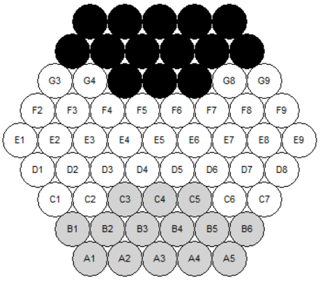
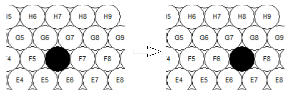
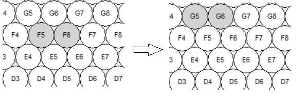
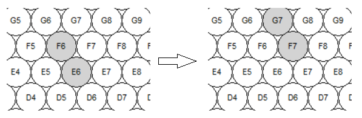
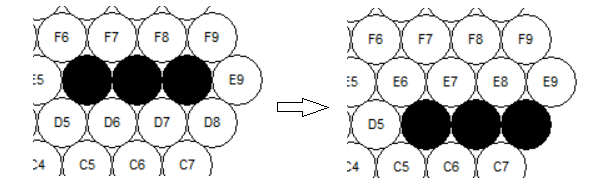
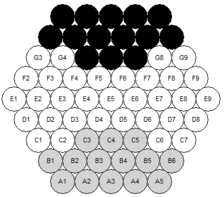
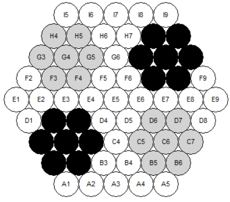

# Part 1

## Contents

### I &nbsp;&nbsp;&nbsp;&nbsp;Game Board Representation

### II &nbsp;&nbsp;&nbsp;Moving Notation

### III&nbsp;&nbsp;&nbsp;Problem Formulation

### IV&nbsp;&nbsp;Team Member Contribution

### I&nbsp;&nbsp;&nbsp;&nbsp; Game Board Representation

The game board is represented by 61 circles; Each circle has a tag made of a letter and a number. Each circle can
contain a white or a black marble.  


### II&nbsp;&nbsp;&nbsp;&nbsp;Moving Notation

Moves are represented as `[[X], Z]`, where:

- X: Contains coordinates of each marble that will be moved in an array
- Z: Direction of movement (R, L, UL, DL, UR, DR).
    - R: Right
    - L: Left
    - UL: Up Left
    - DL: Down Left
    - UR: Up Right
    - DR: Down Right

#### Example Notation with Pictures

- Single Black Marble Move Right: `[[F6] ,R]`
  
- Double White Marble (Straight Line) Move Up Left: `[[F5,F6], UL]`
  
- Double White Marble (Diagonal) Move Up Right: `[[F6,E6], UL]`
  
- Triple Black Marble Move Down Right: `[[E6,E7,E8],DR]`
  

### III&nbsp;&nbsp;&nbsp;&nbsp;Problem Formulation

#### a. State Representation

The state is represented by a dictionary(`{circle_name: circle_object}`) of circles that can contain a black or white
marble. With each move, the
marble(s) are moved to the intended circle. It also has a `captured_mables` attribute that stores how many white or
black marbles are captured.

```javascript
state = {
    captured_mables: [w, b],
    circles: {
        "I5": {marble: marble_object(black | white)},
        "H5": {marble: none},
        "G5": {marble: none},
        ...,
    }
}
```

#### b. Initial State

The initial state can be one of three states:

1. Standard  
   
2. German Daisy  
   
3. Belgian Daisy  
   

#### c. Actions

The actions are defined using the move notation and involve moving marbles (1 to 3) to one of six directions (as defined
in part II).

#### d. Transition Model

| Actions            | Resulting State                                     |
|--------------------|-----------------------------------------------------|
| `[[marble(s)],R]`  | Move each marble to: Circle(old_l, old_num + 1)     |
| `[[marble(s)],L]`  | Move each marble to: Circle(old_l, old_num - 1)     |
| `[[marble(s)],UL]` | Move each marble to: Circle(old_l + 1, old_num)     |
| `[[marble(s)],UR]` | Move each marble to: Circle(old_l + 1, old_num + 1) |
| `[[marble(s)],DL]` | Move each marble to: Circle(old_l - 1, old_num - 1) |
| `[[marble(s)],DR]` | Move each marble to: Circle(old_l - 1, old_num)     |

#### e. Goal Test

The goal test consists of checking if any player has gotten six of the opposite marbles out of the board.

### IV&nbsp;&nbsp;Team Member Contribution  