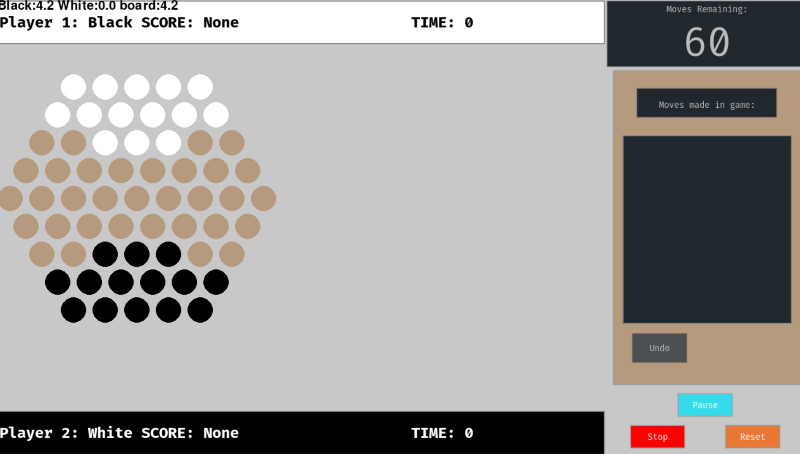
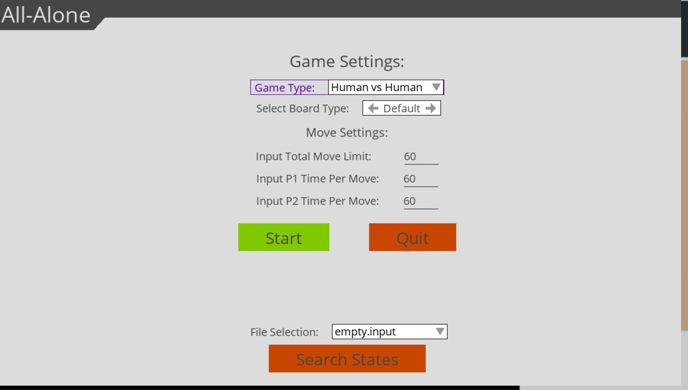

# Part 2

# Ab Alone

## Description

Abalone is a two-player abstract strategy game where players move marbles on a hexagonal board with the goal of pushing
the opponent's marbles off the board. The game requires tactical thinking and careful planning to outmaneuver the
opponent and win.

## How to Run the Game

To run the game, execute the `all_alone_ai_game.exe` file or in the command console run `all_alone_ai_game.exe`.

## How to build the Game

To build the game run `pyinstaller --name="name_of_game" --onefile -w --add-data "gui_json/theme.json:gui_json/" game_control.py`

the build file will need to be moved to folder where the test files are located if state space
generation needs to be tested

## Configuration

The game can be configured using the drop-down menus in the game interface.

### Setup Type

 

You can select the initial board configration from the drop-down menu.

### Game Type

You can select the type of players' configuration from the drop-down menu.

## Controls

### Start/Reset Game

After the game is configured the game can be started or reset by using the `Start / Reset` button.

### Undo

The played moves can be undone using the `Undo` button.

### Pause/ Unpause

The game can be paused using the `Pause/unpause` button.

### Moving Marbles

1. To move the marbles first select direction to move in the bottom left corner of the game.
2. Select the marble(s) that you wish to move.
3. Select any circle that is touching your last selected marble(s) to move the marbles.